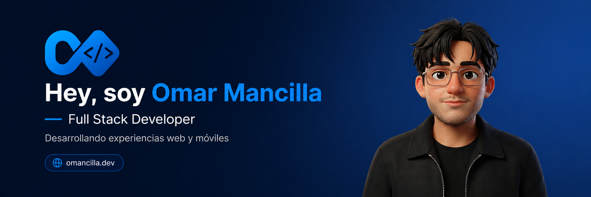

  

 

## 👨‍💻 Sobre mí

> Soy **Omar Mancilla**, desarrollador Full Stack de México y estudiante de Ingeniería en Desarrollo y Gestión de Software.
>
> Desarrollo aplicaciones web y móviles completas, trabajando tanto en la creación de interfaces como en la construcción de APIs, bases de datos e integraciones con servicios externos.
>
> Me interesa crear soluciones útiles, claras y mantenibles, cuidando la experiencia de usuario y aprendiendo continuamente con cada proyecto.

 

  

 

## ⚙️ Stack tecnológico

| Área | Tecnologías |
|:---|:---|
| **🎨 Frontend y móvil** | JavaScript · TypeScript · React · React Native · Next.js · Astro · Tailwind CSS · Expo |
| **⚙️ Backend y desarrollo** | Node.js · Express.js · Laravel · Java · Python · PHP · Moleculer · Zod |
| **🗄️ Datos y servicios** | PostgreSQL · MySQL · MongoDB · SQLite · Firebase · Supabase · Turso · libSQL |
| **☁️ Cloud y herramientas** | Google Cloud · Vercel · Cloudflare · Jenkins · Git · GitHub · Expo Application Services |

 

  

 

## 🌐 Contacto

 

